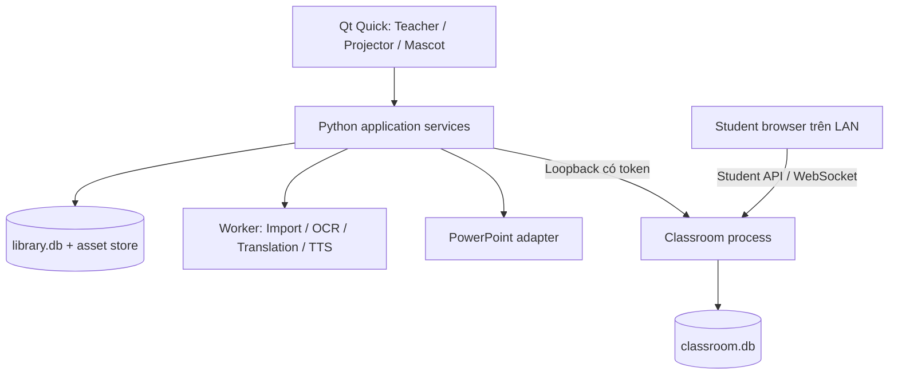

# Kiến trúc BiliClass đề xuất

Phạm vi: công cụ giảng dạy song ngữ Anh–Việt cho các môn THPT. Phần 1–10 lưu thiết kế ban đầu; hiện trạng triển khai RC1 ngày 30/09/2026 ở phần 11 dưới đây. Phiên bản đã khóa trong `requirements-lock.txt`; nghiệm thu thực địa còn theo `STATE.md`.

## 1. Lựa chọn kỹ thuật

| Thành phần | Đề xuất | Lý do / điểm cần kiểm chứng |
|---|---|---|
| Desktop | Python 3.12, PySide6, Qt Quick/QML | Giữ hướng Python trong tài liệu; QML phục vụ giao diện tùy biến và cửa sổ nổi |
| Nghiệp vụ | Python services, typed models/Pydantic | Level, review, pack, quiz không phụ thuộc UI |
| Lưu local | SQLite, migration có version; kho asset trên đĩa | Dễ cài trên một laptop và sao lưu |
| PPTX | python-pptx; adapter PowerPoint COM trên Windows | Tách đọc cấu trúc khỏi trình chiếu/render bằng PowerPoint |
| DOCX | python-docx | Đọc văn bản/bảng; preview nội dung chuẩn hóa |
| PDF | pypdf cho text, pypdfium2 cho render | Hai trách nhiệm riêng; kiểm tra binary và gói phân phối ở M0 |
| Ảnh/OCR | Pillow, Tesseract qua OCRProvider | Xử lý local, dữ liệu ngôn ngữ EN/VI đóng gói riêng |
| Dịch | CTranslate2 CPU INT8 + tokenizer tương ứng | Model VI→EN và EN→VI được chuẩn bị trước; không đóng PyTorch vào runtime chỉ để chuyển đổi model |
| TTS | WindowsTTSProvider; provider local bổ sung nếu cần | Liệt kê và đọc thử giọng thực tế, cache âm thanh |
| Tìm trong bài | Keyword/fuzzy search ban đầu | Có nguồn rõ ràng, không yêu cầu LLM |
| Lớp học | FastAPI + Uvicorn + WebSocket, một worker | Server local; tách cổng quản trị khỏi bề mặt học sinh |
| Student web | HTML/CSS/JS và asset bundled | Không CDN, không yêu cầu cài app |
| Đóng gói | Thử pyside6-deploy/Nuitka từ M0 | Đóng Qt/QML/runtime, sau đó bọc bộ cài Windows |

Qt có hướng dẫn kết nối Python với giao diện QML và công cụ `pyside6-deploy`; đây là căn cứ lựa chọn, chưa chứng minh bản đóng gói BiliClass tương thích mọi máy. [QML](https://doc.qt.io/qtforpython-6/tutorials/qmlapp/qmlapplication.html), [deployment](https://doc.qt.io/qtforpython-6/deployment/deployment-pyside6-deploy.html).

Không dùng Docker runtime, Redis, cloud database hoặc dịch vụ trả phí trong lõi. Mọi model/voice phải được cài trước hoặc nạp từ gói local; app không tự tải ở giữa tiết dạy.

## 2. Ranh giới module và tiến trình



Desktop sở hữu `library.db`: bài, revision, glossary, memory và settings. Classroom process sở hữu `classroom.db`: snapshot đã duyệt, phiên học, người tham gia, câu trả lời và sự kiện. Hai tiến trình không cùng ghi một database. Session nhận bản chụp nội dung đã duyệt, không truy cập trực tiếp draft của Builder.

UI giữ event loop Qt; dịch/OCR/import nặng chạy worker có tiến độ, hủy và timeout. Worker không tự cập nhật widget hay tự ghi đè revision mới hơn. Ghi library đi qua một hàng đợi/repository owner. Job trả về version đầu vào để ngăn kết quả cũ ghi lên nội dung vừa được giáo viên sửa.

Classroom chạy một process, một event loop nghiệp vụ và hàng đợi ghi session. Không dùng nhiều Uvicorn worker chia rời state in-memory. App quản lý startup/health/shutdown, dừng nhận đáp án khi đóng phiên, giải phóng port và không để tiến trình mồ côi. Khi UI crash, server chuyển sang trạng thái tạm dừng sau timeout heartbeat quản trị; phục hồi từ dữ liệu đã ghi.

## 3. Pipeline nội dung song ngữ

`Import → Parse/Normalize → Concept Model → Bilingual Engine → Lesson Intelligence → Teacher Review → Lesson Pack → Readiness Check → Teach`

Mỗi bước có trạng thái, đầu vào có version, kết quả nháp, lỗi đọc được và khả năng chạy lại riêng bước. Parse/OCR không tự phê duyệt nội dung. Lưu nguồn text và vị trí tham chiếu để giáo viên kiểm tra.

Chuẩn hóa thành block: heading, paragraph, list, table, image, formula, caption và notes. Giữ công thức/ký hiệu/đơn vị/tên riêng như các đoạn được bảo vệ. Khi không đọc được cấu trúc, giữ ảnh gốc và yêu cầu review; không biến công thức thành văn bản sai rồi dịch tiếp.

Subject là dữ liệu, không phải nhánh code. Giáo viên có thể thêm môn và chủ đề. Bộ thử phải có từ đa nghĩa, nhiều đoạn, bảng, công thức, trích dẫn và môn tự tạo. Ngữ cảnh dịch gồm môn, khối, đoạn lân cận và thuật ngữ đã duyệt. Không tuyên bố model tự hiểu chương trình phổ thông.

Thứ tự bản dịch: override đã khóa trong bài → exact teacher memory phù hợp phạm vi/môn/cặp ngôn ngữ → glossary phù hợp môn → model. Fuzzy memory chỉ gợi ý; không tự áp nếu câu hoặc ngữ cảnh khác. Lưu bộ nhớ ở phạm vi chung chỉ khi giáo viên chủ động chọn.

Glossary protection cần kiểm tra đầu ra, không chỉ thay từ bằng chuỗi placeholder rồi tin model giữ nguyên. Những bản dịch làm mất số, ký hiệu hoặc thuật ngữ khóa chuyển trạng thái cần sửa. Giáo viên vẫn có thể hoàn thiện bằng tay khi model thiếu/chất lượng chưa đạt.

Hai ứng viên benchmark là OPUS-MT VI→EN và EN→VI. Model card hiện có cặp ngôn ngữ tương ứng và khai báo Apache-2.0; cần lưu revision, tokenizer, checksum và license cùng gói trước phân phối. Chưa có đánh giá chất lượng đa môn THPT. [VI→EN](https://huggingface.co/Helsinki-NLP/opus-mt-vi-en), [EN→VI](https://huggingface.co/Helsinki-NLP/opus-mt-en-vi).

CTranslate2 có runtime Windows x64 và CPU; kiểm tra SSE/ISA, runtime C++ và compute type thực tế ở M0. Model conversion làm trên máy build; tokenizer và model phải cùng revision. [Cài đặt](https://opennmt.net/CTranslate2/installation.html), [CPU](https://opennmt.net/CTranslate2/hardware_support.html), [chuyển model](https://opennmt.net/CTranslate2/guides/transformers.html).

## 4. Import và trình chiếu là hai việc khác nhau

`DocumentImporter` xuất cấu trúc nội dung; `PreviewRenderer` tạo hình xem trước; `PresentationAdapter` theo dõi/điều khiển buổi trình chiếu. Không yêu cầu một thư viện làm cả ba.

python-pptx dùng để đọc/tạo/cập nhật PPTX. Trong kiến trúc này không dùng nó như bộ máy render slide. Ưu tiên PowerPoint COM export preview khi đã có PowerPoint; nếu không có, cho xem nội dung chuẩn hóa và nói rõ giới hạn giữ bố cục. [Phạm vi python-pptx](https://python-pptx.readthedocs.io/en/latest/).

PowerPoint COM adapter theo dõi slideshow và xác nhận slide thực tế sau chuyển. Event `SlideShowNextSlide` xảy ra trước chuyển slide, nên không lấy event đó làm bảo đảm nội dung hiện tại đã đổi xong. Kiểm tra jump/back/hidden slides/custom show và định danh deck; đọc trạng thái thực tế, có chọn slide thủ công khi sync lỗi. [PowerPoint event](https://learn.microsoft.com/en-us/office/vba/api/powerpoint.application.slideshownextslide).

Không giả định mỗi click tương đương một slide: click có thể chỉ chạy animation. Không ghi file nguồn hoặc tự tắt Protected View/macro security. Khi deck đã thay đổi sau import, so hash/slide mapping và đề nghị nhập cập nhật; không âm thầm áp nội dung cũ.

PDF text/render dùng adapter riêng; OCR chỉ chạy trang thiếu text hoặc do giáo viên chọn. DOCX không hứa giữ phân trang giống Word. V1 xuất PPTX mới theo template song ngữ, không tái dựng mọi animation/video của nguồn. [pypdf](https://pypdf.readthedocs.io/en/stable/user/extract-text.html), [PDFium](https://pypdfium2.readthedocs.io/en/stable/), [Tesseract](https://tesseract-ocr.github.io/tessdoc/Data-Files-in-different-versions.html).

## 5. Ngữ cảnh dạy học và mascot

Một `LessonContext` thống nhất gồm lesson revision, slide ID, concept ID, level, layout, ngôn ngữ hỗ trợ, trạng thái audio, trạng thái quiz. Toolbar và mascot đọc cùng context. Hai màn hình nhận view model khác nhau từ context; notes/answer key chỉ nằm trong teacher model.

`LessonAssistant` nhận action và truy xuất nội dung đã duyệt; giải thích/ví dụ/câu hỏi không có dữ liệu thì nút chỉ rõ phần cần bổ sung. Tra cứu text dùng kết quả có nguồn, cho chọn lại nếu nhiều concept tương đương. Không chạy LLM trong lớp.

Overlay cần thử transparency, click-through, focus và z-order khi PowerPoint full screen. Bố trí theo màn hình người dùng chọn, không chỉ tọa độ tuyệt đối; giới hạn vào vùng hiển thị khi thay DPI/rút projector. Hotkey có thể đổi, kiểm tra xung đột; không lấy F5 của PowerPoint làm phím toàn cục mặc định.

## 6. Âm thanh và trạng thái chuẩn bị

`TTSProvider`: enumerate voices, test, synthesize, stop, capabilities. Adapter Windows cụ thể chọn sau thử SAPI/WinRT ở M0; không coi hai API có cùng danh sách giọng. Windows cung cấp API liệt kê giọng đã cài, nhưng không bảo đảm máy bất kỳ có cả VI/US/UK. [AllVoices](https://learn.microsoft.com/en-us/uwp/api/windows.media.speechsynthesis.speechsynthesizer.allvoices?view=winrt-26100).

Cache key gồm text đã chuẩn hóa, ngôn ngữ, voice/provider/version, cách đọc và tốc độ. Đổi text/voice/tốc độ sẽ invalidation đúng item. Ưu tiên phát file chuẩn bị sẵn; tốc độ 0.75×/1×/1.15× phải được kiểm tra phát âm thực tế, không gán nhãn tốc độ chính xác chỉ dựa trên rate tùy ý của engine.

Sửa bài làm trạng thái Prepared chuyển thành Needs preparation cho phần bị ảnh hưởng; không phát audio cũ dưới câu mới. Thiếu giọng VI vẫn có VI Rescue dạng text; nút đọc VI báo chưa sẵn sàng. Gói có audio cache dùng được trên máy khác mà không cần cùng voice; tạo lại audio cần provider phù hợp.

## 7. LAN và giao thức quiz

Student listener chỉ mở khi giáo viên bắt đầu lớp, bind interface đã chọn; admin listener chỉ loopback, token ngẫu nhiên mỗi lần chạy. Hai router không công bố chung. Student API không có endpoint quản trị, không trả đường dẫn local, lesson gốc, đáp án hoặc notes. WebSocket có xác thực, giới hạn kích thước/tần suất và reconnect. [FastAPI WebSocket](https://fastapi.tiangolo.com/advanced/websockets/).

QR chứa địa chỉ LAN và token/mã tham gia có hạn theo session. Sau join, server cấp participant ID và reconnect token riêng; client không được tự chọn ID để gửi dưới tên người khác. Seat Mode giữ chỗ số thứ tự, xử lý trùng rõ ràng. Có thể chấp nhận cập nhật đáp án trước khi đóng câu; tổng số đã trả lời không tăng khi cập nhật.

Mỗi message có protocol version, message ID, session ID, question round ID và payload. Server là nguồn thời gian/trạng thái; ghi transaction trước khi gửi ACK và cập nhật đếm. Retry cùng message không nhân bản kết quả. Reconnect nhận snapshot hiện tại + sequence thay vì giả định không mất sự kiện.

HTTP/WS trên LAN riêng là giả định triển khai V1, không tuyên bố mã hóa trên mạng trường không tin cậy. Token không thay thế TLS. Giảm dữ liệu cá nhân, khóa phiên và chỉ dùng mạng lớp được phép; khảo sát yêu cầu HTTPS nếu triển khai diện rộng sau V1. Student không cần service worker hoặc camera API để mở trang qua QR hệ thống.

Mạng có client isolation có thể chặn kết nối dù cùng Wi-Fi. “Kiểm tra kết nối” hiển thị bước xử lý dễ hiểu, mở hướng dẫn router/hotspot phù hợp; app không hứa tự tạo hotspot được trên mọi máy. Đổi interface/IP cần cập nhật QR và hướng dẫn join lại.

## 8. Lưu, khôi phục và đóng gói

Draft lưu transaction trong SQLite; `.biliclass` là định dạng trao đổi, không ghi lại toàn ZIP mỗi lần gõ. Assets lưu theo hash; bản nguồn bất biến. Tạo pack vào file tạm, validate/checksum rồi rename nguyên tử. Không đưa dữ liệu học sinh vào pack mặc định.

Import ZIP kiểm tra path traversal, đường dẫn tuyệt đối/symlink, kích thước giải nén và số entry; không thực thi script/macro. Phiên bản schema mới hơn chưa hỗ trợ phải được từ chối an toàn, giữ nguyên file. Backup trước migration, có cách khôi phục.

Runtime đầy đủ trong bộ cài; gói dịch/OCR/voice lớn có thể tách để nạp từ USB. Làm thử installer ngay M0, hoàn thiện M8. Tài nguyên UI/fonts/student web hoạt động local. Chốt danh mục license/phụ thuộc dựa trên các gói thực sự được phát hành, không dựa vào lời quảng bá của framework.

## 9. Cấu trúc mã nguồn dự kiến

```text
app/
  main.py
  ui/qml/             # Shell, Builder, Presentation, Mascot, Settings
  ui/bridges/         # QObject/view models, không chứa logic dịch/chấm điểm
  core/               # Use cases, job lifecycle, context, validation
  lesson/             # Review, revision, pack, asset store
  importers/          # PPTX/DOCX/PDF/text/image adapters
  bilingual/          # Level policy và layout policy độc lập
  translation/        # Provider, glossary, memory, bảo vệ thuật ngữ
  presentation/       # PowerPoint COM và native presentation
  mascot/             # State/action/retrieval
  tts/                # Provider, queue, cache
  classroom/          # Server entry, admin/student routers, session
  quiz/               # Question rounds, responses, scoring
  analytics/          # Chỉ số có mẫu số, report, CSV
  storage/            # Hai database, migration, repositories
student_web/
assets/               # UI/mascot sản xuất; khác với ảnh tham chiếu refs/
tests/fixtures/       # Nhiều bài THPT, không có fixture trung tâm duy nhất
scripts/              # Build, package, benchmark, load test
docs/
refs/
```

Đây là sơ đồ định hướng; chưa tạo các thư mục mã nguồn hay scaffold chỉ để khớp cây thư mục.

## 10. Điều chỉnh sau góp ý và thử M0

ResponseProvider chuẩn hóa participant/question/round/answer/submission/timestamp/source. Analytics độc lập transport; WebQuizProvider trước, BiliCard/camera sau V1. M0 có contract chạy được trong biliclass_m0/contracts.py.

Concept có đầy đủ trường Lesson Intelligence. Grade/education_level/subject cấu hình bằng dữ liệu; memory ít nhất teacher + subject. Trạng thái bài DRAFT/REVIEW_REQUIRED/READY_TO_TEACH tách khỏi job/cache. Readiness có warning và override ghi nhận.

Benchmark đầu tiên dùng Argos Translate 1.9/CTranslate2 INT8; chưa khóa model sản phẩm. Native loaders có lỗi đường dẫn tiếng Việt nên nạp SentencePiece và model bằng bytes do Python đọc. M0 dùng PyInstaller onedir để kiểm chứng đóng gói; Nuitka để xem xét sau. Qt Controls dùng Basic style cho UI tùy biến.

M2 nhập PPTX, DOCX, PDF text và TXT; M7 thêm OCR ảnh/PDF scan, edge cases và xuất deck. Chưa nhận kết quả local là nghiệm thu điện thoại/projector/laptop 8 GB.

## 11. Hiện trạng RC1

Các module thực thi dùng cấu trúc phẳng có phân trách nhiệm: `ui.py`/QML nối giao diện, `library.py`/`storage.py`/`pack.py` quản lý dữ liệu; `translation.py`/`text_quality.py`/`presentation_policy.py` xử lý song ngữ; `teaching.py`/`content.py` quản lý nội dung đã chuẩn bị; `powerpoint.py`, `ocr.py`, `speech.py`, `audio_assets.py` nối nền tảng Windows.

PowerPoint và OCR dùng tiến trình con có timeout để cách ly lỗi native. ClassroomRuntime tạo tiến trình riêng với hai listener: học sinh trên IP LAN đã chọn, quản trị trên loopback kèm bearer ngẫu nhiên. `classroom_store.py` ghi SQLite trước ACK; snapshot công khai loại đáp án trước công bố. `classroom.py` thăm dò trạng thái bằng worker, không chặn Qt. `analytics.py` đọc kết quả lưu bền; web học sinh nằm trong `app/student_web` và không dùng CDN.

TTS thực tế chọn SAPI: tốc độ -3…3, không gán hệ số phát âm giả. Audio WAV có manifest gắn văn bản/ngôn ngữ để chuyển máy. OCR thực tế dùng Windows OCR; PDF scan render bằng PDFium. Không có dịch vụ sinh nội dung cloud trong RC1.

PyInstaller onedir/windowed kèm runtime; installer PowerShell theo tài khoản và model pack độc lập. Cấu hình Uvicorn không dùng formatter đòi console. Source/font/QML/student web/model được đọc từ nguồn local, hỗ trợ đường dẫn Unicode. Thư viện và classroom DB được sao lưu bằng SQLite backup, không chép nóng WAL đơn lẻ.
