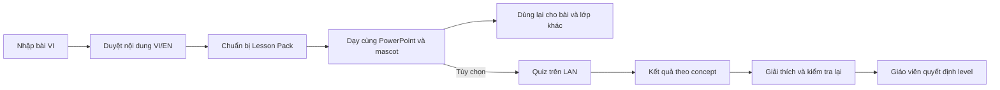

# Kế hoạch xây dựng BiliClass

Ngày lập: 29/09/2026. Đề xuất thực hiện theo mốc có sản phẩm chạy được và tiêu chí nghiệm thu. Thư mục dự án ban đầu chưa có mã nguồn; hiện đã lưu hồ sơ và ảnh tham chiếu.

**Cập nhật 30/09/2026:** tài liệu này giữ kế hoạch gốc. RC3 đã có các nhóm chức năng M1–M7 và phần đóng gói M8, khôi phục cổng lớp, kiểm tra nâng cấp trên máy phát triển và sáu tab Cài đặt. Trạng thái thực thi, bằng chứng local và các nghiệm thu thực địa còn mở xem `STATE.md`, `APP_RESULTS.md`, `TASKS.md`; những mô tả “chưa có mã nguồn” bên dưới thuộc thời điểm lập kế hoạch.

## 1. Hướng triển khai

Xây công cụ hỗ trợ giảng dạy song ngữ Anh–Việt cho giáo viên THPT (lớp 10–12), dùng được với nhiều môn và nhiều bài giảng. Lớp nội dung song ngữ là trung tâm sản phẩm: dịch theo ngữ cảnh, quản lý thuật ngữ, giáo viên duyệt, điều chỉnh mức tiếng Anh, trình bày và phát âm. Mascot, quiz và báo cáo hỗ trợ trung tâm này.

Ứng dụng desktop Windows dựa trên Python/PySide6, giao diện Qt Quick/QML theo bộ ảnh, cùng trang web học sinh rất nhẹ chạy từ máy giáo viên. PowerPoint gốc tiếp tục đảm nhiệm trình chiếu khi dùng Companion Mode. Lesson Pack chứa lớp nội dung song ngữ đã được giáo viên duyệt. Không gắn cứng một bài học hay môn học vào luồng xử lý.

Milo là cáo cam năng động; Lumi là rái cá nâu điềm tĩnh. Cả hai dùng cùng năng lực trợ lý, tách lựa chọn nhân vật khỏi giọng đọc. Giữ nền sáng, chữ navy, thao tác chính màu xanh và điểm nhấn cam của thương hiệu. Chi tiết xem `DESIGN_SPEC.md`.

Ưu tiên hoàn thành một vòng sử dụng song ngữ thật, kiểm chứng trên nhiều dạng bài trước khi mở rộng tất cả định dạng:

## 2. Những điều chỉnh từ tài liệu và ảnh

| Quan sát | Quyết định trong kế hoạch |
|---|---|
| Tài liệu đề xuất PySide6; ảnh cần nhiều thành phần tùy biến | Dùng PySide6 với Qt Quick/QML; làm thử giao diện và bản đóng gói sớm |
| Ảnh Import hiển thị Lumi nhưng lời dẫn gọi Milo | Nội dung lấy tên từ nhân vật đang chọn |
| Quiz đang diễn ra nhưng màn hình học sinh tô xanh đáp án B | Chỉ tô đáp án đúng sau khi công bố; tách dữ liệu teacher/student |
| Ảnh có một bài học minh họa và khối lớp ngoài THPT | Chỉ lấy bố cục/nhận diện; nội dung thật lấy từ bài giáo viên nhập; mặc định khối 10–12 |
| Có dòng “tự động chấm bằng AI” | Quiz đóng chấm bằng đáp án đã duyệt; nhãn là “Chấm tự động” |
| URL minh họa biliclass.vn/AB12 | Tạo QR từ địa chỉ LAN thực tế; mã lớp không thay thế kết nối mạng |
| Builder trông giống trình soạn slide đầy đủ | V1 tập trung duyệt lớp song ngữ; chức năng chèn tự do video/hình khối/biểu đồ chưa có thì không hiện nút giả |
| Ảnh rất rộng, mascot lớn | Thiết kế lại mật độ cho laptop 1366×768; mascot thu gọn khi dạy |
| Tài liệu gọi thứ tự Phase 0–11 và “Phase 2+” | Dùng M0–M8 cho tiến độ; “sau V1” cho BiliCard và các tính năng mở rộng |

Các điều chỉnh trên là đề xuất triển khai nhằm giữ đúng ý đồ sản phẩm; không coi mọi con số, câu chữ hay nút trên mockup là yêu cầu tính năng.

## 3. Lộ trình và sản phẩm mỗi mốc

Ngày công dưới đây là ước lượng lập kế hoạch cho một lập trình viên có kinh nghiệm làm toàn thời gian, có công cụ hỗ trợ. Bao gồm sửa lỗi cơ bản của mốc; chưa phải cam kết thời gian.

| Mốc | Sản phẩm bàn giao | Điều kiện nghiệm thu | Ngày công |
|---|---|---|---:|
| M0 — Kiểm chứng và thiết kế | Thử PowerPoint/overlay, model/voice, LAN; quy chuẩn UI; một bản app tối thiểu đóng gói | Có bằng chứng chạy trên máy Windows mục tiêu và quyết định cho các rủi ro lớn | 4–6 |
| M1 — Nền tảng | App shell 5 mục, settings, SQLite/migration, log, autosave cơ bản, token thiết kế, demo dữ liệu | Khởi động/đóng/mở lại; điều hướng, lưu setting; không mất dữ liệu khi thiếu gói | 5–7 |
| M2 — Nhập bài và Lesson Pack | PPTX/DOCX/PDF text/TXT đa môn, nguồn bất biến, cấu trúc bài, Builder bản đầu, lưu/mở pack có version | Các bài đại diện mở lại đúng text/concept/asset; môn tự tạo hoạt động; hash nguồn không đổi | 5–8 |
| M3 — Song ngữ và duyệt | Provider dịch local, glossary, translation memory, policy L0–L5, bốn layout, kiểm tra nội dung thiếu | L0→L1→L2 không import lại; bản khóa giữ nguyên; sửa nội dung làm mất hiệu lực cache liên quan | 7–10 |
| M4 — Dạy học, mascot, TTS | Companion sync, fallback thủ công, toolbar, hai màn hình, Milo/Lumi, âm thanh cache, VI Rescue | Dạy từ pack đã chuẩn bị khi chặn Internet; đúng slide/concept; không mất focus hoặc lộ ghi chú | 7–10 |
| M5 — Lớp học và quiz | LAN server, QR, mobile UI, Anonymous/Seat, 3 loại câu hỏi, cập nhật trực tiếp và reconnect | 40 client mô phỏng, thêm kiểm tra điện thoại thật; không đếm trùng, không lộ đáp án | 6–9 |
| M6 — Báo cáo và MVP | Concept bars, misconception, recheck, CSV, gợi ý có điều kiện | Chạy được luồng song ngữ trên nhiều bài THPT; báo cáo khớp dữ liệu gốc và mẫu số | 3–5 |
| M7 — Hoàn thiện phạm vi V1 | Ảnh/PDF scan OCR, edge cases, kiểm chứng đủ level/layout, xuất PPTX mới, hoàn thiện asset | Fixture từng định dạng đạt; OCR sửa được; deck mới mở được, không thay file gốc | 6–9 |
| M8 — Độ bền và phát hành | Kiểm thử offline/mạng/crash/DPI, bộ cài, gói model/voice, hướng dẫn, thử lớp thật | Cài sạch không Python; hoàn tất tiết học trên máy mục tiêu; các lỗi chặn dạy đã xử lý | 7–10 |

Tổng cơ sở: 50–74 ngày công. Dành thêm khoảng 25% cho tích hợp và sửa lỗi thực địa: khoảng 63–93 ngày công, tương đương 13–19 tuần với một người toàn thời gian. Thời gian chờ giáo viên thử và chuẩn bị tài nguyên có thể làm lịch dài hơn. Ước lượng lại sau M0 và sau tiết thử đầu tiên; hỗ trợ bằng công cụ lập trình không thay thế kiểm thử PowerPoint, mạng và máy chiếu thật.

Quan hệ phụ thuộc chính: M0 → M1 → M2 → M3 → M4 → M5 → M6 → M7 → M8. Sau M4 phải có bản lõi song ngữ để giáo viên thử trên nhiều bài: nhập → duyệt VI/EN → level/layout → phát âm → dạy → lưu dùng lại. Không chờ hoàn thiện quiz/báo cáo mới thử giá trị cốt lõi. M6 là MVP có thêm tương tác lớp học. Thử nghiệm LAN thực hiện sớm ở M0, phần asset có thể làm song song sau khi quy chuẩn nhân vật ổn định. TTS làm cùng mascot ở M4 để tránh xây trạng thái nói mà chưa có âm thanh thật.

Đối chiếu tài liệu gốc: Phase 0 → M0/M1; 1/3 → M2 và phần định dạng M7; 2 → M3; 4/5/6 → M4; 7/8 → M5; 9 → M6; 10/11 → kiểm tra xuyên suốt và M8.

## 4. Bốn thử nghiệm phải làm ở M0

| Thử nghiệm | Cách kiểm chứng | Quyết định nếu chưa đạt |
|---|---|---|
| PowerPoint và overlay | Deck có animation/video, tiến/lùi/nhảy slide, Presenter View, màn hình phụ, mất kết nối COM | Giữ chế độ chọn slide/concept thủ công; không tuyên bố auto-sync cho cấu hình chưa thử |
| Dịch và phát âm CPU | Khoảng 100 câu giáo dục có thuật ngữ, dấu VI, số và công thức; chạy CPU, đo RAM/thời gian; thử voice thực tế | Thay model/provider sau benchmark; chỉ ra phần cần giáo viên sửa; không âm thầm dùng cloud |
| LAN của lớp | Hai điện thoại Android/iPhone và laptop trên Wi-Fi/router/hotspot không Internet | Hướng dẫn đổi mạng/router khi client isolation chặn; không giả định mọi hotspot đều cho 40 máy |
| Qt và đóng gói | Shell QML, mascot trong suốt, DPI, nhiều màn hình; chạy bản đóng gói trên máy không Python | Sửa phụ thuộc/render backend trước; giảm hiệu ứng nếu cần; ghi rõ giới hạn hỗ trợ |

M0 cũng chốt phiên bản dependency tương thích, gói model có checksum, khả năng phân phối runtime/voice/font, cách tạo preview PowerPoint và bộ tiêu chí đánh giá bản dịch. Chưa tải model lớn hoặc mua dịch vụ trong giai đoạn lập kế hoạch.

## 5. Kịch bản nghiệm thu xuyên suốt

Bộ kiểm thử gồm ít nhất năm bài ngắn, phủ lớp 10–12 và các nhóm: công thức/ký hiệu, thuật ngữ khoa học, văn bản diễn giải, bảng biểu/dữ liệu và môn do giáo viên tự tạo. Đây là các ca thử năng lực của công cụ; không xây khóa học hay nội dung chuyên môn mẫu thành tính năng sản phẩm. Lựa chọn bài cụ thể cùng giáo viên trong M0.

1. Nhập lần lượt các bài PPTX/văn bản của nhiều môn, có thuật ngữ trùng chữ nhưng khác nghĩa và nội dung cấu trúc khác nhau; không thay code theo từng bài.
2. So sánh file nguồn trước/sau bằng hash; giữ nguyên nội dung, animation và video trong file nguồn.
3. Chuyển L1 → L2; duyệt thuật ngữ; sửa một bản dịch và lưu vào memory của môn. Mở bài khác cùng môn thấy gợi ý đúng; mở môn khác không bị áp nhầm nghĩa đã khóa.
4. Chọn Milo hoặc Lumi, giọng EN thực tế; chuẩn bị âm thanh; đóng rồi mở lại pack.
5. Chặn Internet, giữ LAN; bắt đầu tiết học và đồng bộ slide/concept.
6. Phát âm ở tốc độ thường/chậm, gọi giải thích, ví dụ, câu hỏi và VI Rescue.
7. Học sinh vào lớp, chọn đáp án; teacher thấy số lượng tăng; student không thấy đáp án trước công bố.
8. Mô phỏng một máy mất mạng rồi trở lại; gửi lại cùng câu trả lời không làm tăng đếm.
9. Với bài có quiz đã duyệt, đóng câu hỏi; xem hiểu nhầm từ metadata; giải thích lại concept; mở lượt recheck riêng. Bài không có quiz vẫn chuẩn bị và dạy song ngữ được.
10. Xem before/after kèm số người và số câu; xuất CSV; kết thúc phiên; khởi động lại vẫn mở được kết quả.

Kịch bản xấu bổ sung: thiếu voice/model, pack hỏng/path traversal, PPTX khác file đã nhập, port bận, rút máy chiếu, mạng đổi IP, kết nối WebSocket mất, bài nguồn chỉ có ảnh, câu hỏi không đủ dữ liệu, tắt app trong khi lưu.

## 6. Mục tiêu chất lượng ban đầu

Các số dưới đây là mục tiêu để đo trên máy mốc, chưa có benchmark xác nhận.

| Chỉ số | Mục tiêu và cách đo |
|---|---|
| Mở shell | ≤5 giây trong điều kiện máy nhàn; ghi cả cold/warm start |
| Thao tác nội dung đã cache | p95 ≤200 ms đến phản hồi UI; phát audio cache p95 ≤300 ms |
| Quiz LAN | p95 ≤500 ms từ server nhận đến dashboard, đo riêng thời gian gửi từ điện thoại |
| Số kết nối | 40 tối thiểu, thử tải 50; kiểm tra ít nhất 5 điện thoại thật trước thử lớp đầy đủ |
| Bộ nhớ | Hướng tới ≤1 GB khi dạy không model dịch; đỉnh chuẩn bị bài ≤3 GB riêng BiliClass trên máy 8 GB |
| Tài liệu đầu vào | Giới hạn mặc định đề xuất 50 MB/tệp; giới hạn trang/ảnh/giải nén chốt sau benchmark |
| Nội dung đã khóa | Không bị ghi đè; lỗi thuật ngữ/số/công thức phải được đánh dấu trước duyệt |
| Offline | Không có request Internet bắt buộc trong kịch bản nghiệm thu; gói cài được nạp từ USB |

Mục tiêu hiệu năng chưa đạt phải dẫn đến tối ưu hoặc thu hẹp phạm vi có ghi nhận; không tự sửa số để đánh dấu hoàn thành.

## 7. Kiểm thử và phân công

- Lập trình: unit cho policy level, khóa dịch, cache, pack và tính điểm; integration cho import/SQLite/server/provider; end-to-end cho luồng mẫu.
- Thiết kế: chụp UI ở 1366×768 và 1920×1080, kiểm tra bàn phím/focus/DPI/chữ có dấu; xem máy chiếu từ xa; kiểm tra mascot không che nội dung.
- Giáo viên thử nghiệm: kiểm chứng thuật ngữ và bản dịch trong nhiều môn THPT, cảm nhận giọng đọc và thao tác trong lớp. Mời ít nhất ba giáo viên ở các nhóm môn khác nhau nếu có điều kiện. Đây là công việc đề xuất, chưa có người được phân công.
- Kiểm thử thiết bị: PowerPoint thật, ít nhất một máy Windows cài sạch, router/hotspot và điện thoại thật. Client giả lập không chứng minh chất lượng Wi-Fi thực địa.

Mỗi mốc lưu hướng dẫn chạy, bằng chứng kiểm tra và lỗi còn lại trong `STATE.md`; thay đổi quyết định ghi vào `DECISIONS.md`. Tiêu chí lỗi chặn phát hành: mất bài, lộ đáp án/ghi chú, không dạy offline được sau chuẩn bị, sai thống kê, crash trong luồng chính.

## 8. Giả định cần xác nhận trong quá trình triển khai

Tạm lấy Windows 11 x64/RAM 8 GB/có PowerPoint làm mốc. Cần biết thêm phiên bản PowerPoint tại trường, projector dùng Extend hay Duplicate, số học sinh có điện thoại, quy định dùng điện thoại và chất lượng LAN. Chưa có những thông tin này vẫn có thể làm thiết kế và nền tảng; kiểm thử phát hành phụ thuộc thiết bị thực tế.

Cần chọn lớp và bộ bài thật để thử; xác nhận tên/nhận diện BiliClass và mascot trước khi làm bộ asset hoàn chỉnh; xác nhận mô hình phân phối trước khi chốt toàn bộ gói đi kèm. Không cần ra quyết định về cloud, thanh toán hoặc app mobile ở V1.

## 9. Bước triển khai đầu tiên

Thực hiện M0: chốt thiết kế Home/Builder/Presentation ở độ phân giải laptop, thử Companion với PowerPoint, benchmark dịch/voice và thử LAN; tạo bản shell đóng gói nhỏ để kiểm tra khả năng cài. Sau đó mới bắt đầu M1 với kết quả thử nghiệm làm căn cứ.

Hồ sơ hiện tại đã hoàn tất phần tiếp nhận và lập kế hoạch. Không có app shell, model, database runtime hay test ứng dụng được tạo/chạy trong lượt lập kế hoạch này.
